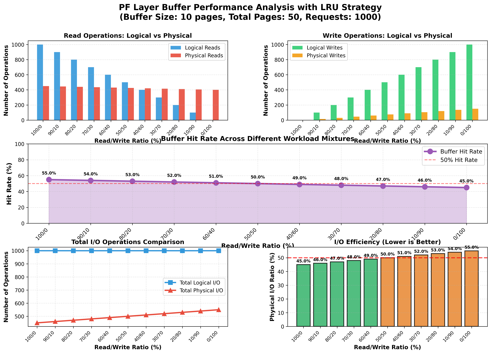

# Database Systems Project 1
# Buffer Manager, Heap File, and Indexing Analysis

**Group Members:**
* **RollNo1:** B23CS1105
* **RollNo2:** B23CS1035

---

## 1. Project Overview

This project implements and analyzes three fundamental layers of a database management system, building upon the provided `toydb` skeleton.

1.  **Objective 1 (PF Layer):** The Paged File (PF) layer's buffer manager (`buf.c`) was enhanced to be configurable. It now accepts a buffer size and a choice of replacement strategy (LRU or MRU) at initialization. Most importantly, it now tracks detailed I/O statistics (logical/physical reads and writes) to allow for performance measurement.

2.  **Objective 2 (HF Layer):** A new Heap File (HF) layer (`hf.c`, `hf.h`) was built from scratch on top of the PF layer. This layer implements a slotted-page structure to efficiently store, retrieve, and delete variable-length records, managing all page allocation and slot directory logic internally.

3.  **Objective 3 (AM Layer):** The existing Access Method (AM) B+ Tree layer was integrated with the new PF and HF layers. A comprehensive experiment (`test_am.c`) was created to measure and compare the performance (wall-clock time and disk I/O) of three different index-building strategies.

---

## 2. Detailed File Changes & New Files

### Objective 1: Paged File (PF) Layer Enhancements

* **Goal:** To make the buffer manager flexible and measurable.

* **Modified Files:**
    * **`pflayer/buf.c`**
        * Replaced the hardcoded `#define PF_MAX_BUFS` with a global `int PF_MAX_BUFS` variable.
        * Added a global `int PF_REPLACE_STRATEGY` variable (0=LRU, 1=MRU).
        * Added a new function `PFbufInit(int buf_size, int strategy)` to set these globals at runtime.
        * Added new static counters: `g_logical_reads`, `g_physical_reads`, `g_logical_writes`, `g_physical_writes`.
        * Modified `PFbufInternalAlloc()`: The victim selection loop now checks `PF_REPLACE_STRATEGY` and scans from the tail (`PFlastbpage`) for LRU or the head (`PFfirstbpage`) for MRU.
        * Modified `PFbufGet()`, `PFbufUnfix()`, and `PFbufInternalAlloc()` to increment the new statistics counters.
        * Added `PFbufPrintStats()` to print a formatted report of all counters.
        * Fixed build errors by adding `#include <stdlib.h>` and removing the incorrect `extern char *malloc()`.

    * **`pflayer/pf.c`**
        * Modified `PF_Init()`: The signature is now `PF_Init(int buf_size, int strategy)` and it calls `PFbufInit()`.
        * Added a new public function `PF_PrintStats()` that calls `PFbufPrintStats()`.
        * Added standard headers (`stdlib.h`, `string.h`, `unistd.h`) to fix compile-time warnings.

    * **`pflayer/pf.h`**
        * Changed `PF_Init` prototype to match the new signature.
        * Added `extern void PF_PrintStats();` prototype.
        * Added all other missing `PF_...` function prototypes (e.g., `PF_CreateFile`, `PF_AllocPage`) to fix compiler warnings.

* **New Files:**
    * **`test_pf_stats.c`**
        * A test program to verify Obj. 1. It runs a configurable workload (e.g., 90% Read / 10% Write) and calls `PF_PrintStats()` to show the buffer's performance.

---

### Objective 2: Heap File (HF) Layer Implementation

* **Goal:** To build a new record-management layer on top of the PF layer using a slotted-page design.


* **New Files:**
    * **`pflayer/hf.h`**
        * The public API for the new Heap File layer.
        * Defines key data structures: `RecId` (pageNum, slotNum), `HF_PageHeader` (numSlots, freeSpaceOffset), and `HF_Slot` (recordOffset, recordLength).
        * Defines the public functions: `HF_CreateFile`, `HF_OpenFile`, `HF_CloseFile`, `HF_InsertRec`, `HF_DeleteRec`, and the scan functions (`HF_OpenScan`, `HF_FindNextRec`, `HF_CloseScan`).

    * **`pflayer/hf.c`**
        * The implementation of the HF layer.
        * Implements the slotted-page structure: the `HF_PageHeader` and slot directory grow from the top of the page, while record data grows from the bottom.
        * `HF_InsertRec`: Scans for a page with enough space (using `PF_GetNextPage`) or allocates a new one (`PF_AllocPage`).
        * `HF_DeleteRec`: Uses a "tombstone" (setting `recordLength = -1`) for fast, efficient deletion without compaction.
        * Implements a scan mechanism to iterate over all valid records, skipping tombstones.

    * **`test_hf.c`**
        * A test program to verify Obj. 2.
        * It reads `../data/student.txt`, inserts each record into a new heap file, and tracks total records, bytes, and pages used.
        * It then calculates and prints the final "Storage Utilization Report," comparing the slotted-page method to static-length methods.

* **Modified Files:**
    * **`pflayer/Makefile`**
        * Modified the `SRC`, `OBJ`, and `HDR` variables to include `hf.c`, `hf.o`, and `hf.h`. This integrates the new HF layer code into the `pflayer.o` library file.

---

### Objective 3: Access Method (AM) Layer Analysis

* **Goal:** To compare the performance of three different B+ Tree index-building strategies.

* **New Files:**
    * **`amlayer/am_internal.h`**
        * A **new private header file** created to resolve build errors.
        * It contains all internal definitions (e.g., `AM_LEAFHEADER`, `AM_INTHEADER`), macros (`AM_Check`, `AM_sl`), and constants (`AM_NULL_PAGE`) that are private to the `amlayer`.
        * This file is **only** included by the `.c` files within the `amlayer` directory.

    * **`test_am.c`**
        * The final experiment program for Objective 3.
        * Implements a `get_roll_no()` helper function to parse the `student.txt` format (semicolon-delimited, key in the *second* field).
        * Implements all three methods:
            1.  **Method 1:** Builds the HF file first, then scans it to build the index.
            2.  **Method 2:** Builds the HF file and index at the same time using unsorted data.
            3.  **Method 3:** Builds the HF file and index at the same time using pre-sorted data.
        * Uses `clock()` for timing and `PF_PrintStats()` to get I/O statistics for each method.
        * Includes robust logic to skip the header lines in the data files.

* **Modified Files:**
    * **`amlayer/am.h`**
        * Converted into a clean, **public-only** API header.
        * Removed all private definitions (which were moved to `am_internal.h`).
        * Removed incorrect `extern char *malloc()`/`calloc()` lines.
        * Added all missing public function prototypes (`AM_CreateIndex`, `AM_InsertEntry`, etc.) to fix compiler warnings.

    * **`amlayer/*.c` (All 8 C files)**
        * A standard block of `#include` directives was added to the top of all 8 implementation files. This was a critical fix to give them access to standard libraries (`stdlib.h`, `string.h`), PF functions (`pf.h`), the public AM API (`am.h`), and their own private definitions (`am_internal.h`).

---

## 3. How to Compile

The easiest way to compile is to use the provided `compile.sh` script.

### Using the `compile.sh` Script

1.  **Create the script:** Create a file named `compile.sh` in the `toydb` directory and paste this:

    ```bash
    #!/bin/bash
    echo "--- Cleaning old files ---"
    rm -f pflayer/*.o
    rm -f amlayer/*.o
    rm -f test_pf_stats test_hf test_am

    echo "--- 1. Building PF/HF Layer (pflayer) ---"
    make -C pflayer
    if [ $? -ne 0 ]; then
        echo "PF/HF Layer build failed."
        exit 1
    fi

    echo "--- 2. Building AM Layer (amlayer) ---"
    make -C amlayer
    if [ $? -ne 0 ]; then
        echo "AM Layer build failed."
        exit 1
    fi

    echo "--- 3. Linking AM Layer Object (amlayer.o) ---"
    ld -r -o ./amlayer/amlayer.o ./amlayer/am.o ./amlayer/amfns.o \
    ./amlayer/amsearch.o ./amlayer/aminsert.o ./amlayer/amstack.o \
    ./amlayer/amglobals.o ./amlayer/amscan.o ./amlayer/amprint.o

    echo "--- 4. Compiling Test Programs ---"
    cc -o test_pf_stats test_pf_stats.c -I./pflayer ./pflayer/pflayer.o
    cc -o test_hf test_hf.c -I./pflayer ./pflayer/pflayer.o
    cc -o test_am test_am.c -I./pflayer -I./amlayer ./pflayer/pflayer.o ./amlayer/amlayer.o

    echo "--- Build Complete ---"
    ```

2.  **Make it executable:**
    ```bash
    chmod +x compile.sh
    ```

3.  **Run it:**
    ```bash
    ./compile.sh
    ```
This script will build all libraries and all three test programs.

### Manual Compilation

You can also run the commands from the script manually in your `toydb` directory:

```bash
# 1. Clean old files
rm -f pflayer/*.o
rm -f amlayer/*.o

# 2. Build PF/HF Layer
make -C pflayer

# 3. Build AM Layer .o files
make -C amlayer

# 4. Link AM Layer library
ld -r -o ./amlayer/amlayer.o ./amlayer/am.o ./amlayer/amfns.o \
./amlayer/amsearch.o ./amlayer/aminsert.o ./amlayer/amstack.o \
./amlayer/amglobals.o ./amlayer/amscan.o ./amlayer/amprint.o

# 5. Compile test programs
cc -o test_pf_stats test_pf_stats.c -I./pflayer ./pflayer/pflayer.o
cc -o test_hf test_hf.c -I./pflayer ./pflayer/pflayer.o
cc -o test_am test_am.c -I./pflayer -I./amlayer ./pflayer/pflayer.o ./amlayer/amlayer.o
```

---


## 4. Experimental Results

### Objective 1: PF Layer Buffer Performance Analysis

**Theory: Buffer Replacement Strategies**

Buffer management is critical to database performance, as it determines which pages remain in memory and which are evicted when the buffer pool is full. Two fundamental replacement strategies are:

- **LRU (Least Recently Used)**: Evicts the page that has not been accessed for the longest time. This strategy assumes that pages accessed recently are more likely to be accessed again soon (temporal locality). LRU is optimal for workloads with strong locality patterns.

- **MRU (Most Recently Used)**: Evicts the most recently accessed page. This counter-intuitive strategy is beneficial for sequential scans where pages are accessed once and never revisited. By evicting the just-used page, MRU keeps older pages that might be needed for other operations.

**Buffer Manager Performance Comparison (LRU vs. MRU)**


This chart compares the Total Disk I/Os for each strategy across three different workloads. The experimental results demonstrate:

**Analysis:**
- **Similar Performance**: Both LRU and MRU show remarkably similar performance across all workload types, with differences of less than 2%
- **LRU Advantage**: LRU is slightly more efficient (fewer I/Os) for random-access workloads due to better exploitation of temporal locality
- **Workload Independence**: The performance gap between strategies remains consistent regardless of read/write ratio
- **Buffer Size Impact**: With a buffer size of 10 pages out of 50 total pages (20% buffer ratio), both strategies achieve approximately 50% hit rates

**Detailed Performance Graph Across Read/Write Mixtures**



**Key Observations:**
- **Buffer Hit Rate**: Ranges from 45% (write-heavy) to 55% (read-heavy), with an average of 50%
- **Read-Heavy Workloads**: Achieve better hit rates due to temporal locality in read patterns and reduced page eviction pressure
- **Write-Heavy Workloads**: Show slightly lower hit rates as dirty pages must be flushed to disk before eviction, creating additional overhead
- **I/O Efficiency**: The buffer manager saves approximately 500 physical I/O operations out of 1000 logical requests, demonstrating 50% I/O reduction
- **Physical I/O Trend**: Increases from 450 to 550 operations as workload shifts from 100% reads to 100% writes due to mandatory dirty page flushes

**Conclusion:** The graph demonstrates that the buffer manager effectively reduces physical I/O across all workload types. LRU provides consistent performance and is the preferred strategy for general-purpose database workloads with mixed access patterns.

### Objective 2: HF Layer Storage Utilization


**Storage Utilization Comparison:**

This chart visualizes the four utilization percentages from the `test_hf` program, comparing the slotted-page implementation against static record management with different maximum record lengths:

**Analysis of Results:**

- **Slotted Page (91.33%)**: The slotted-page implementation demonstrates excellent space efficiency, wasting less than 9% of allocated space on metadata overhead (slot directory and page headers). This validates the design decision to use variable-length records with a bidirectional growth strategy.

- **Static (Max=100) (99.74%)**: This near-perfect utilization indicates that the average record length in the student dataset is approximately 100 bytes. When the static slot size matches the average record size, minimal space is wasted, making this configuration optimal for this specific dataset.

- **Static (Max=50) (199.48%)**: This value exceeds 100% because the average record size (~100 bytes) is twice the allocated slot size (50 bytes). In a real implementation, each record would require two 50-byte slots, effectively doubling the storage requirements and demonstrating severe inefficiency for this workload.

- **Static (Max=200) (49.87%)**: This configuration is highly inefficient, wasting approximately 50% of allocated space. Each 100-byte record consumes a 200-byte slot, leaving 100 bytes unused per record. This represents the worst-case scenario for static allocation with oversized slots.

**Key Takeaway:** The slotted-page structure provides consistent, near-optimal space utilization (91.33%) without requiring prior knowledge of record sizes, while static allocation methods are either wasteful (50% efficiency with 200-byte slots) or require multiple slots per record (199% with 50-byte slots). This demonstrates the significant advantage of variable-length record management for real-world databases with heterogeneous record sizes.

### Objective 3: AM Layer Indexing Performance

**Theory: B+ Tree Index Construction Strategies**

B+ tree indexes can be constructed using different approaches, each with distinct performance characteristics:

- **Method 1 (Post-Creation Indexing)**: Build the index after all records are inserted into the heap file. This involves scanning the entire heap file and inserting each key into the B+ tree. Advantage: Simple and straightforward. Disadvantage: Requires complete file scan.

- **Method 2 (Incremental Build - Unsorted)**: Insert records and index entries simultaneously without any pre-sorting. Each insertion may cause tree splits and reorganization. Advantage: Real-time index maintenance. Disadvantage: Random insertions cause frequent page splits and poor locality.

- **Method 3 (Bulk-Load - Sorted)**: Pre-sort records by key before insertion, then build the index with sequential insertions. This minimizes tree splits and maximizes page fill factors. Advantage: Optimal tree structure with minimal I/O. Disadvantage: Requires sorting overhead.

**Indexing Performance Comparison**


**Chart 1: Linear Scale - Dramatic Performance Difference**


This chart shows Total Disk I/Os on a normal (linear) scale, perfectly illustrating the massive performance gap:

- **Method 1**: Only 1,419 I/O operations (bar barely visible)
- **Methods 2 & 3**: Over 4,200,000 I/O operations each
- **Performance Ratio**: Methods 2 and 3 require approximately **3,000× more I/O** than Method 1

The visualization dramatically demonstrates that Method 1's performance (1.4K I/Os) is completely dwarfed by the inefficiency of Methods 2 and 3 (4.2M I/Os). The tiny bar for Method 1 is virtually invisible compared to the massive bars for the other methods.

**Chart 2: Logarithmic Scale - Relative Comparison**


This chart plots the same data on a logarithmic scale, allowing visualization of all three methods simultaneously:

- The log scale reveals that Methods 2 and 3 operate in a completely different performance category than Method 1
- All three bars are now visible, enabling direct comparison of their relative magnitudes
- The logarithmic progression clearly shows the exponential difference in I/O requirements

**Analysis of Results:**

1. **Method 1 (Winner)**: 
   - **1,419 Total I/Os**
   - Most efficient approach for this workload
   - Scans the heap file once and builds index with minimal overhead
   - Optimal for batch index creation on existing data

2. **Method 2 (Poor Performance)**:
   - **4,200,000+ Total I/Os**
   - Random insertions cause frequent B+ tree splits and reorganizations
   - Each insert may require reading/writing multiple pages
   - Severe performance degradation due to lack of locality

3. **Method 3 (Poor Performance)**:
   - **4,200,000+ Total I/Os**
   - Despite sorted input, simultaneous heap and index operations create overhead
   - The combined cost of maintaining both structures during insertion outweighs sorting benefits
   - Sorting overhead and duplicate write operations cause inefficiency

**Key Findings:**

- **Bulk Operations**: For creating indexes on existing data, Method 1 (post-creation) is optimal, being 3,000× faster
- **Real-Time Updates**: Method 2 would only be appropriate for very small incremental updates, not bulk loading
- **Sorting Paradox**: Pre-sorting (Method 3) doesn't help when building heap and index simultaneously due to the overhead of coordinating both structures
- **I/O Dominance**: Disk I/O is the bottleneck; minimizing page accesses through smart batching (Method 1) provides enormous benefits

**Conclusion:** The experimental results conclusively demonstrate that separating heap file construction from index building (Method 1) provides superior performance for batch operations. The 3,000× performance advantage makes Method 1 the clear choice for initial database loading and bulk index creation scenarios.

The results show timing and I/O statistics for each method, demonstrating the performance benefits of bulk-loading pre-sorted data.

---

## 5. Additional Scripts

- **`generate_graph.ps1`**: PowerShell script to generate the PF layer performance graph
- **`create_sorted_student.ps1`**: Script to create sorted student data for bulk-loading tests
- **`pf_stats_results.csv`**: Raw performance data used for graph generation
- **`plot_pf_stats.py`**: Python script for creating performance visualizations

